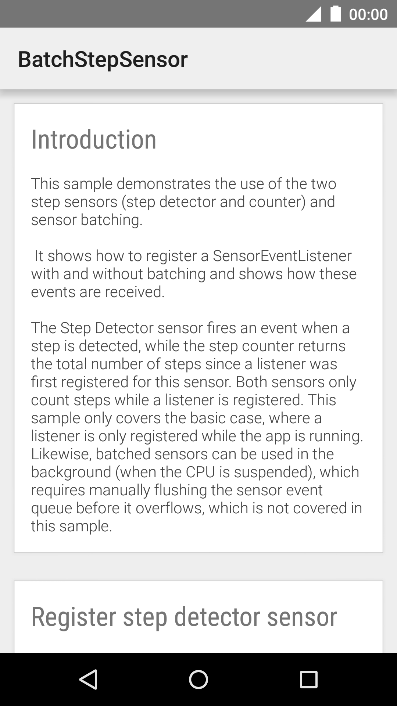
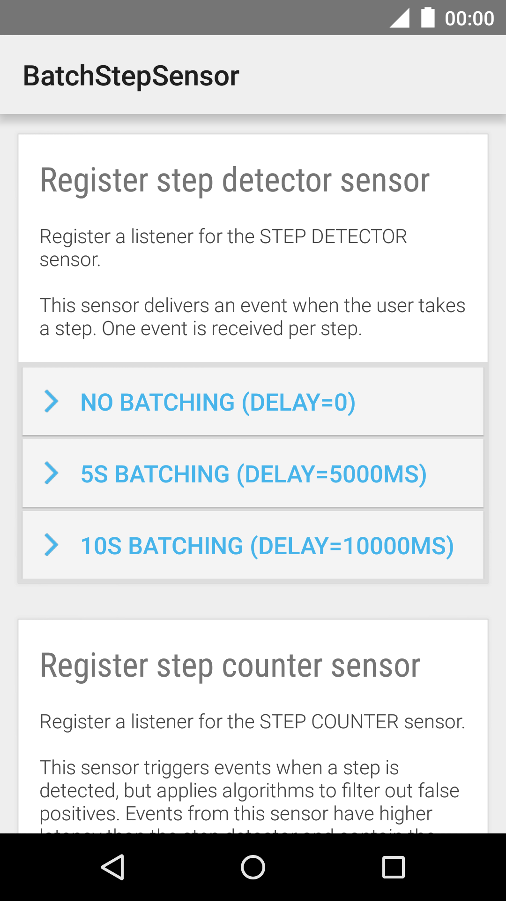
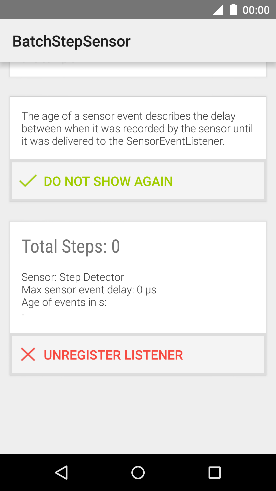
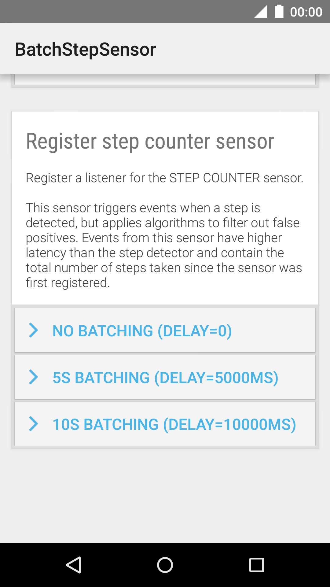
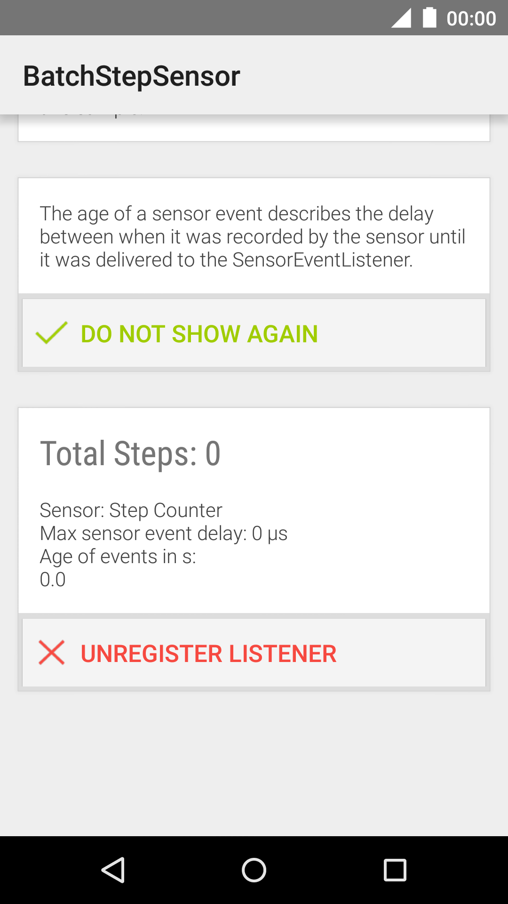

Android BatchStepSensor Sample
===================================

Sample demonstrating how to set up SensorEventListeners for step
detectors and step counters.

Introduction
------------

This sample demonstrates the use of the two step [sensors][1] (step detector and counter) and
sensor batching.

It shows how to register a [SensorEventListener][2] with and without
batching and shows how these events are received.

The Step Detector sensor fires an
event when a step is detected, while the step counter returns the total number of
steps since a listener was first registered for this sensor.

Both sensors only count steps while a listener is registered. This sample only covers the
basic case, where a listener is only registered while the app is running. Likewise,
batched sensors can be used in the background (when the CPU is suspended), which
requires manually flushing the [sensor event][3] queue before it overflows, which is not
covered in this sample.

[1]: https://developer.android.com/reference/android/hardware/Sensor.html
[2]: https://developer.android.com/reference/android/hardware/SensorEventListener.html
[3]: https://developer.android.com/reference/android/hardware/SensorEvent.html

Pre-requisites
--------------

- Android SDK 28
- Android Build Tools v28.0.3
- Android Support Repository

Screenshots
-------------

      

Getting Started
---------------

This sample uses the Gradle build system. To build this project, use the
"gradlew build" command or use "Import Project" in Android Studio.

Support
-------

- Stack Overflow: http://stackoverflow.com/questions/tagged/android

If you've found an error in this sample, please file an issue:
https://github.com/android/sensors

Patches are encouraged, and may be submitted by forking this project and
submitting a pull request through GitHub. Please see CONTRIBUTING.md for more details.
